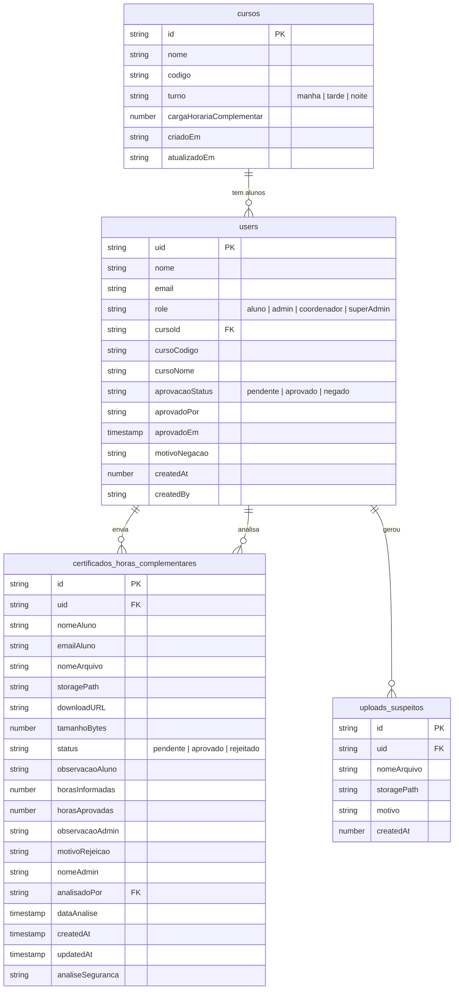

# Diagrama do Banco de Dados — SIGHC

Sistema de Gestão de Horas Complementares — Faculdade Senac Pernambuco

## Coleções Firestore



## Descrição das coleções

### `users`
Todos os usuários do sistema. O campo `role` define o nível de acesso:
- `aluno` — acessa apenas a própria área de envio de certificados
- `coordenador` — aprova/rejeita certificados e gerencia usuários pendentes
- `admin` — mesmo acesso do coordenador, criado via SuperAdmin
- `superAdmin` — acesso total: cria cursos, alunos, admins e coordenadores

O campo `aprovacaoStatus` controla se o aluno foi aprovado pelo coordenador para usar o sistema (`pendente` → `aprovado` ou `negado`).

### `cursos`
Catálogo de cursos da instituição. Cada aluno é vinculado a um curso via `cursoId`. O campo `cargaHorariaComplementar` define a meta de horas que o aluno precisa cumprir.

### `certificados_horas_complementares`
Registro central de todos os certificados enviados pelos alunos. O ciclo de vida de um certificado:
1. Aluno faz upload → status `pendente`
2. Backend valida o PDF (cabeçalho, tamanho, conteúdo suspeito)
3. Se inválido → salvo com status `rejeitado` automaticamente (campo `analiseSeguranca = "rejeitado"`)
4. Se válido → arquivo movido de `certificados_temp/` para `certificados/` e status permanece `pendente`
5. Coordenador/Admin analisa → status muda para `aprovado` (com `horasAprovadas`) ou `rejeitado` (com `motivoRejeicao`)

### `uploads_suspeitos`
Log de segurança. Qualquer arquivo rejeitado pela análise automática do backend (PDF inválido, muito grande, ou com estruturas suspeitas como `/JavaScript`, `/EmbeddedFile`) é registrado aqui para auditoria.

## Firebase Storage

Além do Firestore, o sistema usa o Firebase Storage com a seguinte estrutura de pastas:

```
certificados_temp/{uid}/{timestamp}-{nome}.pdf   ← upload inicial (temporário)
certificados/{uid}/{timestamp}-{nome}.pdf        ← após validação aprovada
```

## Índices compostos necessários (Firestore)

Para que as queries com `orderBy` funcionem sem fallback client-side, criar os seguintes índices:

| Coleção | Campos | Ordem |
|---------|--------|-------|
| `certificados_horas_complementares` | `uid`, `createdAt` | uid ASC, createdAt DESC |
| `certificados_horas_complementares` | `status`, `createdAt` | status ASC, createdAt DESC |
