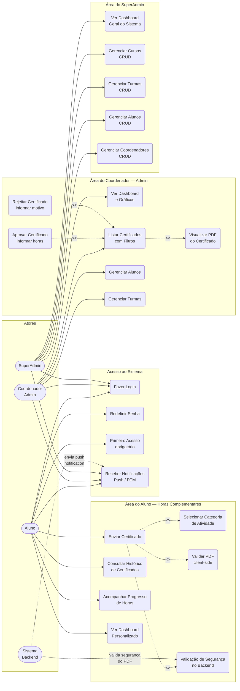
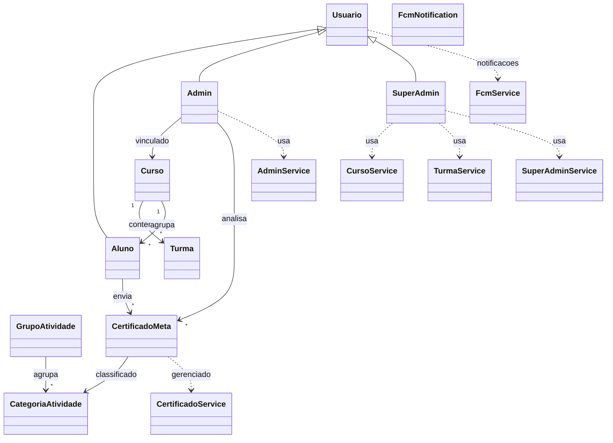
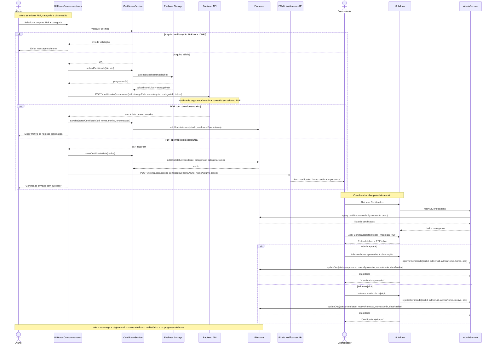

# Modelagem UML — SIGHC

## Sistema de Gerenciamento de Horas Complementares | Faculdade Senac PE

Este documento apresenta 4 diagramas para a apresentação ao cliente:

1. Diagrama de Casos de Uso
2. Diagrama de Classes
3. Diagrama de Sequência
4. Diagrama de Arquitetura do Sistema

---

## 1) Diagrama de Casos de Uso

---

## 2) Diagrama de Classes

---

## 3) Diagrama de Sequência

Cenário: **envio de certificado pelo aluno com validação de segurança e aprovação pelo coordenador**.

---

## 4) Diagrama de Arquitetura do Sistema

```mermaid
flowchart TB
    subgraph Cliente ["Frontend — PWA (React + Vite + TypeScript)"]
        direction TB
        subgraph PagesAluno ["Páginas do Aluno"]
            P_HC[HorasComplementares\nDashboard / Histórico / Orientações]
        end
        subgraph PagesAdmin ["Páginas do Admin"]
            P_Admin[Admin\nDashboard / Certificados]
        end
        subgraph PagesSA ["Páginas do SuperAdmin"]
            P_SA[SuperAdmin\nCursos / Turmas / Alunos / Coordenadores]
        end
        subgraph PagesAuth ["Autenticação"]
            P_Login[Login]
            P_FP[ForgotPassword]
            P_FA[FirstAccess]
        end

        CTX[AuthContext\ngerencia sessão e role]
        SW[Service Worker\nnotificações background]
    end

    subgraph Firebase ["Firebase (Google Cloud)"]
        FB_Auth[Firebase Auth\nautenticação JWT]
        FB_Store[Firestore\nBanco de dados NoSQL]
        FB_Storage[Firebase Storage\narquivos PDF]
        FB_FCM[Firebase Cloud Messaging\nnotificações push]
    end

    subgraph Backend ["Backend API (REST — Node.js)"]
        BE_Certs[POST /certificados/processar\nvalidação de segurança do PDF]
        BE_Cursos[CRUD /cursos]
        BE_Turmas[CRUD /turmas]
        BE_Alunos[CRUD /alunos]
        BE_Admins[CRUD /admins]
        BE_Notif[POST /notificacoes/upload-certificado]
    end

    subgraph Firestore_Collections ["Coleções Firestore"]
        COL_Certs[(certificados_horas_complementares)]
        COL_Cursos[(cursos)]
        COL_Users[(users — fcmTokens)]
    end

    P_HC -->|upload PDF| FB_Storage
    P_HC -->|salva meta| COL_Certs
    P_HC -->|processarCertificado| BE_Certs
    P_HC -->|notifica upload| BE_Notif

    P_Admin -->|lê/atualiza certificados| COL_Certs
    P_Admin -->|aprovar / rejeitar| COL_Certs

    P_SA -->|CRUD via API| BE_Cursos
    P_SA -->|CRUD via API| BE_Turmas
    P_SA -->|CRUD via API| BE_Alunos
    P_SA -->|CRUD via API| BE_Admins

    P_Login --> FB_Auth
    P_FA --> FB_Auth
    P_FP --> FB_Auth

    CTX --> FB_Auth

    BE_Certs -->|move PDF para path final| FB_Storage
    BE_Notif -->|envia push via FCM| FB_FCM
    FB_FCM -->|notificação foreground/background| SW

    Backend -->|lê/escreve| COL_Cursos
    Backend -->|lê tokens FCM| COL_Users
```

---

## Resumo para Apresentação ao Cliente

| Diagrama | O que demonstra |
| --- | --- |
| **Casos de Uso** | Responsabilidades de cada perfil: Aluno, Coordenador (Admin) e SuperAdmin, incluindo o fluxo de validação automática de segurança. |
| **Classes** | Modelo de dados real do sistema com entidades, atributos e relacionamentos tal como implementados no código. |
| **Sequência** | Fluxo completo de ponta a ponta: o aluno envia o PDF, o backend valida a segurança, o coordenador analisa e aprova ou rejeita, e o aluno vê o resultado. |
| **Arquitetura** | Visão macro das camadas: PWA no frontend, Firebase (Auth, Firestore, Storage, FCM) como plataforma de dados e notificações, e API REST no backend. |
